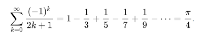

# SWP Praktische Leistungsüberprüfung 5AHWII

## Aufgabe 1: Leibniz-Reihe

... hat folgendes Entstehungsgesetz:



### 1.a (8P): Testmethode

Mit `deno init` ist ein "nacktes" Projekt zu erstellen, es wird automatisch gleich eine Testmethode mit erstellt.
Übrigens: `assert.assertAlmostEquals(actual, expected, tolerance, msg)` können zwei Werte in einer Testmethode auf "Fast - Gleichheit" hin überprüft werden.

In `main_test.ts` sollte also überprüft werden, ob der erste retournierte Wert tatsächlich `π / 4` ist.

### 1.b (8P): Leibniz Funktion

Gesucht ist hier die Funktion `leibniz(): [number, number]`. Die beiden retournierten Werte sind a) die gefundene Näherung für `π / 4` sowie b) die Anzahl der benötigten Iterationen (also bis sich der Näherungswert nicht mehr ändert).

## Aufgabe 2: SQL

### 2.a (8P): customers-who-never-order

```text
Table: Customers
+-------------+---------+
| Column Name | Type    |
+-------------+---------+
| id          | int     |
| name        | varchar |
+-------------+---------+
```

Id is the primary key (column with unique values) for this table.
Each row of this table indicates the ID and name of a customer.

```text
Table: Orders
+-------------+------+
| Column Name | Type |
+-------------+------+
| id          | int  |
| customerId  | int  |
+-------------+------+
```

Id is the primary key (column with unique values) for this table.
customerId is a foreign key (reference columns) of the ID from the Customers table.
Each row of this table indicates the ID of an order and the ID of the customer who ordered it.

Write a solution to find all customers who never order anything.

Return the result table in any order.

The result format is in the following example.

Example 1:

```text
Input:
Customers table:
+----+-------+
| id | name  |
+----+-------+
| 1  | Joe   |
| 2  | Henry |
| 3  | Sam   |
| 4  | Max   |
+----+-------+
Orders table:
+----+------------+
| id | customerId |
+----+------------+
| 1  | 3          |
| 2  | 1          |
+----+------------+

Output:
+-----------+
| Customers |
+-----------+
| Henry     |
| Max       |
+-----------+
```

Hier sind Testdaten:

```sql
Create table If Not Exists Customers (id int, name varchar(255))
Create table If Not Exists Orders (id int, customerId int)
Truncate table Customers
insert into Customers (id, name) values ('1', 'Joe')
insert into Customers (id, name) values ('2', 'Henry')
insert into Customers (id, name) values ('3', 'Sam')
insert into Customers (id, name) values ('4', 'Max')
Truncate table Orders
insert into Orders (id, customerId) values ('1', '3')
insert into Orders (id, customerId) values ('2', '1')
```

### 2.b (8P): duplicate-emails

```text
Table: Person
+-------------+---------+
| Column Name | Type    |
+-------------+---------+
| id          | int     |
| email       | varchar |
+-------------+---------+
```

id is the primary key (column with unique values) for this table.
Each row of this table contains an email. The emails will not contain uppercase letters.

Write a solution to report all the duplicate emails. Note that it's guaranteed that the email field is not NULL.

Return the result table in any order.

The result format is in the following example.

Example 1:

```text
Input:
Person table:
+----+---------+
| id | email   |
+----+---------+
| 1  | a@b.com |
| 2  | c@d.com |
| 3  | a@b.com |
+----+---------+
Output:
+---------+
| Email   |
+---------+
| a@b.com |
+---------+
```

Explanation: <a@b.com> is repeated two times.

Beispiel-SQL:

```sql
Create table If Not Exists Person (id int, email varchar(255))
Truncate table Person
insert into Person (id, email) values ('1', 'a@b.com')
insert into Person (id, email) values ('2', 'c@d.com')
insert into Person (id, email) values ('3', 'a@b.com')
```

### 2.c (8P): Delete Duplicate Emails

```text
Table: Person
+-------------+---------+
| Column Name | Type    |
+-------------+---------+
| id          | int     |
| email       | varchar |
+-------------+---------+
```

id is the primary key (column with unique values) for this table.
Each row of this table contains an email. The emails will not contain uppercase letters.

Write a solution to delete all duplicate emails, keeping only one unique email with the smallest id.

Please note that you are supposed to write a DELETE statement and not a SELECT one.

After running your script, the answer shown is the Person table. The driver will first compile and run your piece of code and then show the Person table. The final order of the Person table does not matter.

The result format is in the following example.

Example 1:

```text
Input:
Person table:
+----+------------------+
| id | email            |
+----+------------------+
| 1  | <john@example.com> |
| 2  | <bob@example.com>  |
| 3  | <john@example.com> |
+----+------------------+
Output:
+----+------------------+
| id | email            |
+----+------------------+
| 1  | <john@example.com> |
| 2  | <bob@example.com>  |
+----+------------------+
```

Explanation: <john@example.com> is repeated two times. We keep the row with the smallest Id = 1.

Testdaten:

```sql
Create table If Not Exists Person (Id int, Email varchar(255))
Truncate table Person
insert into Person (id, email) values ('1', 'john@example.com')
insert into Person (id, email) values ('2', 'bob@example.com')
insert into Person (id, email) values ('3', 'john@example.com')
```

Erreichbar: 40P. Schlüssel: 0-20/21-25/26-30/31-35/36-40

Gutes Gelingen!
